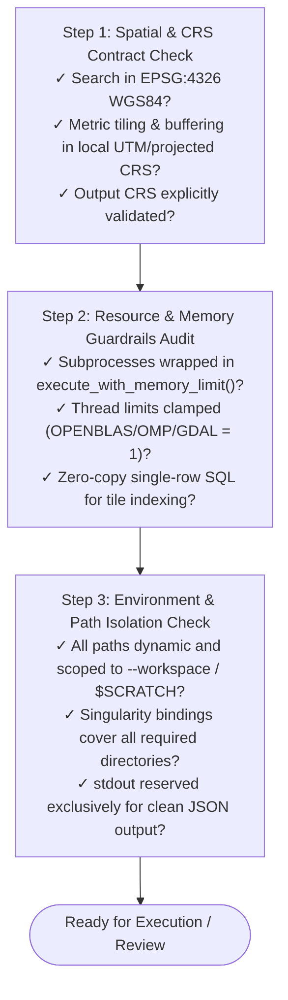

# ALS-Finder: Operational & Engineering Rules

This document defines the strict operational standards, environmental boundaries, anti-patterns, pre-execution verification checklists, and GitHub Issues protocols for the `als-finder` codebase.

---

## 1. Environment Boundaries

```mermaid
graph TD
    subgraph Local Workstation (Desktop / Dev)
        L1[Conda Environment: conda-forge]
        L2[Direct CLI Execution & Interactive Debugging]
        L3[Local Workspace Paths: ./workspace/]
    end

    subgraph Cloud / Container (Server / CI/CD)
        C1[Docker / Podman: micromamba base]
        C2[Volume Mounts: -v $(pwd):/workspace]
        C3[Automated Endpoints & GHCR Image]
    end

    subgraph HPC Clusters (SDSC Expanse / NERSC)
        H1[Singularity / Apptainer .sif]
        H2[Slurm Batch Arrays: #SBATCH --array=0-N]
        H3[Ephemeral Node Scratch: $SCRATCH]
        H4[Zero-Copy On-Demand Streaming: fetch-tile]
    end
```

### 1.1 Execution Environment Matrix

| Dimension | Local Desktop (Dev) | Cloud / Server (Docker) | HPC Supercomputer (Slurm) |
| :--- | :--- | :--- | :--- |
| **Runtime** | Native Conda (`conda-forge`) | Docker (`ghcr.io/...`) | Singularity / Apptainer (`als-finder.sif`) |
| **Job Model** | Interactive CLI | Interactive / Cloud Run | Decoupled Slurm Job Arrays (`--array=0-N`) |
| **Pathing** | Relative / Absolute paths | Container-mounted paths (`/workspace`) | `$SCRATCH` / Lustre / Ceph parallel storage |
| **I/O Strategy** | Full or subset download | Chunked HTTP streaming | Zero-copy single-tile streaming (`fetch-tile`) |
| **Concurrency** | CPU core auto-detection | Container CPU limits | 1 Python worker per task, multi-threaded PDAL |

### 1.2 HPC & Slurm Execution Rules
- **No Heavy I/O on Login Nodes:** Never run full downloads or multi-tile standardization on shared login/head nodes. Run `search` to generate `manifest.json` and `grid.gpkg`, then dispatch compute via Slurm.
- **Decoupled Job Arrays:** HPC batch pipelines MUST use `als-finder fetch-tile --manifest <path> --tile-id ${SLURM_ARRAY_TASK_ID}` to distribute processing across isolated compute nodes.
- **Explicit Singularity Bindings:** Always explicitly bind project directories and scratch storage:  
  `singularity exec --bind ${WORKSPACE}:${WORKSPACE},${SCRATCH}:${SCRATCH} als-finder.sif ...`
- **Scratch Volume Isolation:** Compute workers must write intermediate point clouds to `$SCRATCH` or `$TMPDIR`, copying only final products to permanent project storage.

---

## 2. Anti-Patterns & Known Gotchas (Must Avoid)

### 2.1 Code & Architecture Anti-Patterns
- ❌ **No Logic in `cli.py`:** `cli.py` is strictly an argument parser and command dispatcher. Do NOT implement data streaming, PDAL JSON parsing, or spatial math inside `cli.py`. Keep logic in `src/als_finder/core/`.
- ❌ **No Hardcoded Absolute Paths:** Never hardcode paths like `/home/...` or `C:\...`. Always use `pathlib.Path` and resolve relative to `--workspace` or environment variables.
- ❌ **No Bare `subprocess.run()` for Spatial Binaries:** Never invoke `pdal`, `gdal`, or external binaries via bare `subprocess.run()`. Always use `execute_with_memory_limit()` from `core/standardization.py` to enforce OS-level virtual memory capping.
- ❌ **No Unclamped Thread Spawning:** Underlying C++ libraries (OpenBLAS, GDAL, OMP) spawn excessive threads in child processes, triggering virtual memory exhaustion (`RLIMIT_AS` failure). Always clamp threads (`OPENBLAS_NUM_THREADS=1`, `OMP_NUM_THREADS=1`, `GDAL_NUM_THREADS=1`).
- ❌ **No Stdout Pollution:** Reserve `stdout` exclusively for clean, machine-readable JSON payloads (for `fetch-tile --json` and `grid-info --json`). Direct all logs, warnings, and progress bars strictly to `stderr`.

### 2.2 Spatial & Data Gotchas
- ❌ **No Unprojected Metric Math:** Never calculate tile grids, buffers, SMRF parameters, or distances in unprojected degree space (`EPSG:4326`). Always project to local UTM (auto-detected via `estimate_utm_crs()`) or an explicit metric CRS before spatial slicing.
- ❌ **No Unsigned EPT Bounding Without CRS Translation:** EPT datasets on AWS are indexed in specific coordinate systems (often EPSG:3857 or state-plane). Transforming ROI bounding boxes to the EPT's native coordinate system is mandatory to avoid 0-point empty tile downloads.
- ❌ **No Memory-Heavy Full Ingestion for Single-Tile Lookups:** Do not load the entire `grid.gpkg` or `catalog.gpkg` into memory during worker tasks. Use zero-copy SQL lookups (`SELECT * FROM grid WHERE tile_id = ?` via `pyogrio`).

---

## 3. Pre-Execution 3-Step Verification Checklist

Before proposing script modifications, creating PRs, or executing data pipelines, you **MUST** verify all three checkpoints:



- [ ] **Step 1: Spatial & Coordinate System Verification**
  - Search boundaries and catalog geometry are strictly `EPSG:4326` (WGS84).
  - Spatial grid generation, tiling, and overlap buffering operate in a projected metric CRS.
  - Output projection is validated and matches downstream requirements (e.g., `EPSG:3857` or target UTM).

- [ ] **Step 2: Resource & Memory Guardrails Audit**
  - External PDAL/GDAL subprocesses are wrapped in `execute_with_memory_limit()`.
  - Multi-threading environment variables are clamped (`OPENBLAS_NUM_THREADS=1`, `OMP_NUM_THREADS=1`, `GDAL_NUM_THREADS=1`).
  - Tile lookups on HPC execute via single-row SQL queries rather than full dataset loads.

- [ ] **Step 3: Environment & Path Isolation Audit**
  - Paths use `pathlib.Path` and adhere to Hive directory partitioning (`provider=*/dataset=*`).
  - Container and HPC executions explicitly bind all workspace and `$SCRATCH` paths.
  - Logging and progress indicators are routed to `stderr`; `stdout` outputs clean JSON.

---

## 4. GitHub Issues & External Memory Protocol

GitHub Issues serve as the permanent, shared technical memory and audit trail across this Cloud/HPC infrastructure. To avoid lost context between development sessions, all issues must adhere to strict engineering standards.

### 4.1 Strict Issue Creation Standards
**Never create vague or purely conversational issues.** Every newly opened GitHub issue MUST include the following 5 mandatory sections:
1. **Runtime Target:** Explicitly specify the execution environment (Local Desktop / Cloud VM / Docker / Singularity / Slurm Cluster).
2. **Affected Paths:** Exact file paths (e.g. `src/als_finder/core/grid_manager.py`), function names, and line numbers.
3. **Environment Constraints:** Required conda environment (`als-finder-env`), scratch space bindings (`$SCRATCH`), memory limits (`RLIMIT_AS`), or API credentials (`OPENTOPOGRAPHY_API_KEY`).
4. **Explicit Anti-Patterns & Dead Ends:** Document what NOT to do, prior failed approaches, and why they broke (preventing future sessions from repeating failed investigations).
5. **Verification & Definition of Done:** Exact CLI/Pytest command, batch script test, and tangible output checks (exit code 0, non-empty `.laz` tile) that prove the issue is resolved.

### 4.2 Issue Ingestion Rule
When assigned or instructed to work on an existing GitHub Issue:
- **Verify Runtime & Paths:** Read referenced source files and confirm the target execution environment before touching code.
- **Check Constraints & Anti-Patterns:** Review documented dead ends to ensure the new approach does not re-introduce known failure modes.
- **Formulate Implementation Plan:** Present an implementation plan and verification command for review before modifying code.

### 4.3 Issue Closure Rule
When resolving and closing a GitHub Issue:
- **Summarize Changes:** Provide a concise breakdown of root cause and exact changes made across modules.
- **Document New Environment Quirks:** Record any newly discovered runtime edge cases, container quirks, or compiler behaviors.
- **Link Artifacts:** Explicitly reference the fix commit SHA, branch, and PR.

---

## 5. Code Quality & Version Control Standards

- **Formatting & Linting:** Code must be formatted with `black` (88-char limit) and linted with `ruff` or `flake8`.
- **Type Annotations:** All functions must have complete PEP 484 type hints for arguments and return values.
- **Docstrings:** All public modules, classes, and functions must include Google-style docstrings.
- **Testing:** New spatial features or fixes must include unit tests in `tests/` executed via `pytest tests/`.
- **Atomic Commits:** Follow Conventional Commits format: `feat:`, `fix:`, `docs:`, `refactor:`, `perf:`, `test:`, `chore:`. Commit and push immediately upon reaching a stable verified state.
