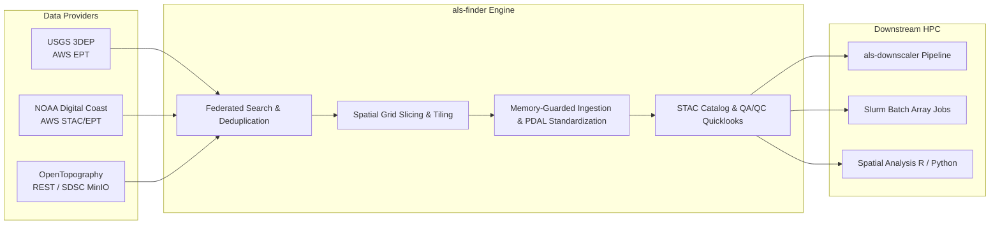
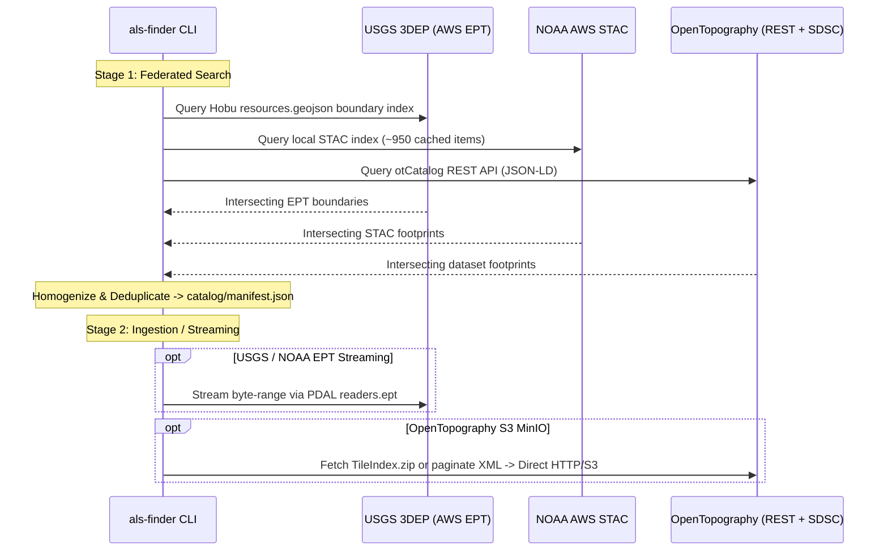
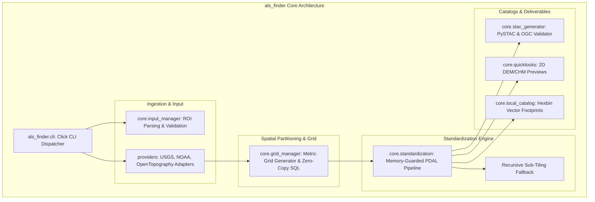
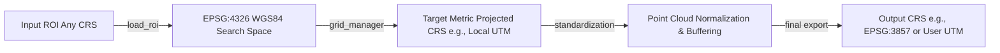

# ALS-Finder: System Architecture & Technical Specifications

**Version**: 0.2.0 (Cloud-Native Multi-Environment)  
**Target Environments**: Desktop (Conda), Cloud (Docker/GHCR), HPC Supercomputers (Singularity/Apptainer/Slurm)

---

## 1. Executive Summary & Purpose

`als-finder` is a high-performance, cloud-native geospatial CLI engine and Python framework designed to search, discover, deduplicate, subset, and standardize airborne LiDAR point cloud data across disparate federal, academic, and commercial repositories.

It acts as the primary data discovery and ingestion gateway for downstream scientific computing pipelines (notably the `als-downscaler` HPC pipeline).



---

## 2. Tech Stack & Environment Matrix

### 2.1 Technology Stack Inventory

| Layer | Component / Tool | Purpose / Function |
| :--- | :--- | :--- |
| **Primary Language** | Python 3.8+ (Target 3.10/3.11) | CLI orchestration, API queries, spatial geometry math, STAC generation, PDAL JSON pipeline construction |
| **Native C/C++ Engines** | PDAL, GDAL, GEOS, PROJ | Point cloud filtering/reprojection/tiling, raster hillshades/CHM generation, spatial geometry operations |
| **Spatial Libraries** | GeoPandas, Shapely, PyProj, Pyogrio, Fiona | Vector processing, ROI boundary parsing, coordinate transformations, fast GeoPackage I/O |
| **Point Cloud I/O** | `laspy`, `lazperf`, `pdal` | Fast chunked LAS/LAZ reading and classification inspection |
| **STAC & Metadata** | `pystac`, `stac-validator` | OGC-compliant SpatioTemporal Asset Catalog generation and schema validation |
| **Cloud Object Storage** | `boto3` (unsigned), `requests` | Multi-threaded HTTP streaming and AWS S3 bucket pagination |
| **Process & Memory Guards**| `resource` (Linux), `psutil` (Windows/Linux) | OS-level virtual memory capping (`RLIMIT_AS`) and thread clamping |
| **CLI & UX** | `click`, `tqdm`, `python-dotenv` | Multi-command interface, progress tracking, environment secret management |

### 2.2 Execution Environment Matrix

```mermaid
graph TD
    subgraph Local Workstation
        L1[Conda / Mamba Environment] --> L2[Direct CLI & Interactive Exploration]
    end

    subgraph Cloud & CI/CD
        C1[Docker Container<br/>mambaorg/micromamba:1.5-jammy] --> C2[GHCR Container Registry]
        C2 --> C3[Cloud Batch / Kubernetes]
    end

    subgraph HPC Clusters e.g., SDSC Expanse
        H1[Singularity / Apptainer .sif] --> H2[Slurm Batch Scripts & Job Arrays]
        H2 --> H3[Node Scratch Volumes $SCRATCH]
    end
```

| Deployment Target | Packaging / Container | Runtime Command | Recommended Use Case |
| :--- | :--- | :--- | :--- |
| **Local Desktop / Dev** | Conda (`conda-forge`) | `als-finder <command>` | Initial ROI exploration, pipeline testing, local processing |
| **Cloud / Server** | Docker (`Dockerfile`) | `docker run -v ... ghcr.io/cms-2024-hudak/als-finder:latest` | Automated microservices, reproducible cloud tasks |
| **HPC Supercomputer** | Singularity / Apptainer | `singularity exec als-finder.sif als-finder <command>` | Massive distributed processing, Slurm array jobs |

---

## 3. Provider Ingestion & Cloud Architecture

`als-finder` interfaces with three primary upstream LiDAR repositories using distinct protocol adapters:



### 3.1 Provider Specifications

| Provider | Data Protocol / Format | Authentication | Ingestion & Subsetting Mechanism |
| :--- | :--- | :--- | :--- |
| **USGS 3DEP** | Entwine Point Tiles (`ept.json`) on AWS S3 (`s3-us-west-2.amazonaws.com/usgs-lidar-public`) | Public (Anonymous / Unsigned) | Spatial bounding queries parsed from Hobu's `resources.geojson`. Streamed on-demand via PDAL `readers.ept`. |
| **NOAA Digital Coast** | AWS S3 STAC items & Entwine Point Tiles (`noaa-nos-coastal-lidar-pds`) | Public (Anonymous / Unsigned) | Cached spatial index (`~/.cache/als-finder/noaa_stac_bounds.geojson`). Streamed via `readers.ept` or downloaded via HTTP. |
| **OpenTopography** | REST JSON-LD API (`/API/otCatalog`) + SDSC S3 Object Storage (`opentopography.s3.sdsc.edu/pc-bulk`) | API Key required for REST queries (`OPENTOPOGRAPHY_API_KEY`) | Reads S3 MinIO bucket directly; downloads dataset `TileIndex.zip` shapefiles to identify intersecting `.laz` tiles. |

---

## 4. Pipeline & Module Architecture



### 4.1 Module Responsibility Matrix

- `als_finder.cli`: Strict entry point and argument parsing. Directs stdout exclusively for machine-readable payloads; all progress and logs flow to stderr.
- `als_finder.core.input_manager`: Robust geometry ingestion (GeoJSON, Shapefile, GPKG, BBox) with automatic reprojection to WGS84 (`EPSG:4326`).
- `als_finder.core.grid_manager`: Snaps spatial footprints to uniform metric grids (default 1200m or 512m with overlap buffers); generates chunked `grid.gpkg` indices and single-row SQL queries.
- `als_finder.core.standardization`: PDAL pipeline construction, ASPRS taxonomy harmonization, ground classification (SMRF / CSF / hybrid-dual / vendor), HAG calculation, and memory-guarded execution.
- `als_finder.core.stac_generator`: Produces OGC-compliant, self-contained SpatioTemporal Asset Catalogs with validated relative link references.
- `als_finder.core.quicklooks`: Fast 2m DEM hillshade, CHM color-relief rendering, and HTML QA/QC summaries for spot verification without 3D GIS overhead.
- `als_finder.core.local_catalog`: Extracts tight polygon boundaries of processed COPC files via `pdal info --boundary`.
- `als_finder.download`: Manages dry-run fetch array matrices (`fetch_array.csv`) and multi-threaded physical binary acquisition.

---

## 5. Architectural Invariants & System Constraints

### 5.1 Coordinate Reference System (CRS) Protocol



1. **Search Space Invariant**: All upstream catalog searches and ROI intersections are evaluated in **WGS84 (`EPSG:4326`)**.
2. **Orchestration Space Invariant**: All spatial grid generation, tiling, and overlap buffering operate in **projected metric coordinates** (auto-detected UTM or explicit EPSG).
3. **Delivery Invariant**: Standardized tiles are exported to user-specified CRS or standard Web Mercator (`EPSG:3857`) for cloud-native COPC visualization.

### 5.2 Workspace Directory & Hive Partitioning Layout

All file outputs are strictly segregated by workspace directories using Hive-style pathing conventions:

```text
<workspace>/
├── .env                              # Workspace-scoped API tokens
├── catalog/
│   ├── manifest.json                 # Master metadata & dataset manifest
│   ├── catalog.gpkg                  # Vector layer of discovered footprints
│   ├── catalog.csv                   # Tabular search summary
│   ├── fetch_array.csv               # Physical download execution matrix
│   ├── grid.gpkg                     # Primary metric grid tile index
│   ├── grids/                        # Hive-partitioned grid indices
│   │   └── tilesize=1200/
│   │       └── buffer=30/
│   │           └── grid.gpkg
│   ├── standardized_catalog.gpkg     # Tight hexbin footprints of processed COPC
│   ├── quicklooks_index.html         # Master QA/QC visual catalog
│   └── stac/                         # OGC-compliant PySTAC catalog
│       ├── catalog.json
│       └── <collection_id>/
│           └── <item_id>/
├── data/
│   ├── raw/                          # Raw or subsetted point clouds
│   │   └── provider=<provider>/
│   │       └── dataset=<dataset_id>/
│   │           └── *.laz
│   ├── standardized/                 # Standardized COPC point clouds
│   │   └── provider=<provider>/
│   │       └── dataset=<dataset_id>/
│   │           └── *.copc.laz
│   └── quicklooks/                   # 2D preview hillshades and CHM PNGs
│       └── provider=<provider>/
│           └── dataset=<dataset_id>/
│               ├── *_elevation_preview.png
│               ├── *_chm_preview.png
│               └── *_quicklook.html
```

### 5.3 Memory Safety & Multithreading Invariants

1. **Subprocess Memory Limits**: Every PDAL and external binary invocation is guarded by `execute_with_memory_limit()` with hard limits (e.g. 1536MB - 4096MB) using `resource.setrlimit(RLIMIT_AS)` on Linux.
2. **Thread Clamping**: Subprocess environments strictly set `OPENBLAS_NUM_THREADS=1`, `OMP_NUM_THREADS=1`, and `GDAL_NUM_THREADS=1` to prevent underlying C++ multi-threading libraries from exhausting stack memory allocations.
3. **Dynamic Recursive Sub-Tiling**: When point density causes an unpredicted out-of-memory exception during PDAL processing, the engine catches `MemoryError`, splits the failing tile into four sub-quadrants, processes each recursively with safety bounds, and merges them back cleanly.
4. **HPC Array Concurrency**: For batch systems (Slurm), Python processes run with `--workers 1` while individual job array tasks execute isolated tile IDs (`--tile-id <N>`) concurrently across distinct compute nodes.
