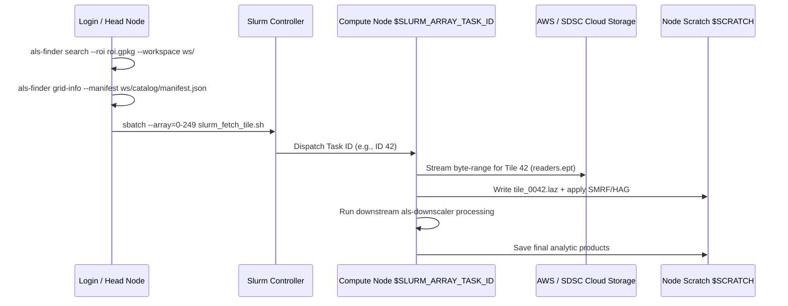

# ALS-Finder: Operational Workflows & Execution Guide

**Version**: 0.2.0  
**Target Environments**: Local Workstations, Docker/Podman, HPC Supercomputing Clusters (Slurm + Singularity/Apptainer)

---

## 1. Overview of Primary Workflows

`als-finder` supports both **interactive multi-stage pipelines** (discovery -> download -> standardization) and **distributed HPC job array workflows** (dynamic single-tile on-demand streaming).

```mermaid
graph TD
    subgraph Workflow 1: Interactive Desktop / Single-Node
        A1[1. Search & Filter<br/>als-finder search] --> A2[2. Dry-Run Review<br/>als-finder download]
        A2 --> A3[3. Physical Download<br/>als-finder download --execute]
        A3 --> A4[4. Standardization<br/>als-finder standardize]
        A4 --> A5[5. QA/QC & STAC<br/>--stac --quicklook]
    end

    subgraph Workflow 2: Distributed HPC Batch / Slurm Array
        B1[1. Search & Grid Index<br/>als-finder search] --> B2[2. Query Grid Bounds<br/>als-finder grid-info]
        B2 --> B3[3. Slurm Job Array<br/>#SBATCH --array=0-N]
        B3 --> B4[4. Single Tile Stream<br/>als-finder fetch-tile --tile-id ${SLURM_ARRAY_TASK_ID}]
        B4 --> B5[5. Downstream Downscaler<br/>als-downscaler worker]
    end
```

---

## 2. CLI Command Reference & Data Flow

### 2.1 Command Summary Matrix

| Command | Primary Function | Key Arguments | Primary Outputs |
| :--- | :--- | :--- | :--- |
| `get-example-roi` | Extracts bundled sample ROI | None | `./ltbmu_boundary.gpkg` |
| `search` | Queries providers and builds catalog | `--roi`, `--name`, `--date`, `--density`, `--workspace`, `--provider`, `--cloud-native` | `catalog/manifest.json`<br/>`catalog/catalog.gpkg`<br/>`catalog/catalog.csv` |
| `update` | Re-runs search with overrides & rollback | `--workspace`, `--name`, `--date`, `--density`, `--provider` | Atomic backups `manifest_<utc>.json` + updated catalog |
| `download` | Dry-run matrix or physical download | `--workspace`, `--roi`, `--execute`, `--full`, `--standardize`, `--crs`, `--workers` | `catalog/fetch_array.csv`<br/>`data/raw/provider=*/dataset=*/*.laz` |
| `standardize` | Standardizes point taxonomy, SMRF, HAG | `--workspace`, `--crs`, `--roi`, `--tile-size`, `--buffer-size`, `--classifier`, `--stac`, `--quicklook` | `data/standardized/.../*.copc.laz`<br/>`catalog/stac/catalog.json`<br/>`catalog/quicklooks_index.html` |
| `fetch-tile` | On-demand streaming of a single spatial tile | `--manifest`, `--tile-id`, `--output`, `--buffer-size`, `--crs`, `--json` | Single standardized `.laz` tile directly on disk |
| `grid-info` | Queries spatial grid metadata for external tools | `--manifest`, `--json` | Machine-readable JSON with grid CRS and bounding specs |
| `clean` | Purges scratch & intermediate workspace data | `--workspace` | Cleaned workspace directory |

---

## 3. Workflow Recipes by Environment

### 3.1 Workflow A: Local Desktop / Development (Conda)

#### Step 1: Initial Discovery & Search
```bash
# Extract the sample Lake Tahoe Basin ROI
als-finder get-example-roi

# Execute federated search across USGS, NOAA, and OpenTopography
als-finder search \
    --roi ./ltbmu_boundary.gpkg \
    --density QL1 \
    --date "2018-01-01/2024-12-31" \
    --workspace ./tahoe_project/ \
    --ot-key "YOUR_OPENTOPO_KEY"
```

#### Step 2: Review Dry-Run Fetch Matrix
```bash
# Generates catalog/fetch_array.csv and displays tabular summary without downloading
als-finder download \
    --workspace ./tahoe_project/ \
    --roi ./ltbmu_boundary.gpkg
```

#### Step 3: Execute Download & Standardization Pipeline
```bash
# Execute physical download, standardize to UTM metric space, and generate STAC + Quicklooks
als-finder download \
    --workspace ./tahoe_project/ \
    --roi ./ltbmu_boundary.gpkg \
    --execute \
    --standardize \
    --crs "EPSG:32610" \
    --stac \
    --quicklook
```

---

### 3.2 Workflow B: Cloud & Container Execution (Docker)

```bash
# Set up workspace mount directory
mkdir -p ./workspace/data

# 1. Search inside Docker container
docker run --rm \
    -e OPENTOPOGRAPHY_API_KEY="YOUR_KEY" \
    -v $(pwd)/workspace:/workspace \
    ghcr.io/cms-2024-hudak/als-finder:latest \
    search \
    --roi /workspace/data/roi.geojson \
    --workspace /workspace \
    --cloud-native

# 2. Execute standardization with memory safety
docker run --rm \
    -v $(pwd)/workspace:/workspace \
    ghcr.io/cms-2024-hudak/als-finder:latest \
    standardize \
    --workspace /workspace \
    --crs "EPSG:3857" \
    --stac \
    --quicklook
```

---

### 3.3 Workflow C: High-Performance Computing (HPC / Slurm Job Array)

In large-scale HPC environments (e.g. SDSC Expanse, NERSC Perlmutter), downloading gigabytes of raw data to shared login nodes causes network bottlenecks and file system saturation.

`als-finder` supports an **HPC-native single-tile streaming pattern** that executes across Slurm job arrays:



#### Slurm Batch Submission Script (`slurm_fetch_tile.sh`):

```bash
#!/bin/bash
#SBATCH --job-name=als_stream_array
#SBATCH --account=your_account
#SBATCH --partition=compute
#SBATCH --nodes=1
#SBATCH --ntasks=1
#SBATCH --cpus-per-task=2
#SBATCH --mem=8G
#SBATCH --time=01:00:00
#SBATCH --array=0-199%20
#SBATCH --output=logs/als_tile_%A_%a.out
#SBATCH --error=logs/als_tile_%A_%a.err

set -euo pipefail

# 1. Environment and Workspace Paths
SINGULARITY_IMAGE="/path/to/containers/als-finder.sif"
WORKSPACE="/path/to/project_workspace"
MANIFEST="${WORKSPACE}/catalog/manifest.json"
OUTPUT_DIR="${SCRATCH}/standardized_tiles"
mkdir -p "${OUTPUT_DIR}" "logs"

TILE_ID=${SLURM_ARRAY_TASK_ID}
OUTPUT_FILE="${OUTPUT_DIR}/tile_${TILE_ID}.laz"

echo "Processing Tile ID: ${TILE_ID} on $(hostname) at $(date)"

# 2. Execute zero-copy on-demand tile stream via Apptainer/Singularity
singularity exec \
    --bind ${WORKSPACE}:${WORKSPACE},${SCRATCH}:${SCRATCH} \
    ${SINGULARITY_IMAGE} \
    als-finder fetch-tile \
    --manifest "${MANIFEST}" \
    --tile-id "${TILE_ID}" \
    --output "${OUTPUT_FILE}" \
    --buffer-size 30 \
    --crs "EPSG:32610" \
    --json

echo "Successfully streamed ${OUTPUT_FILE} (Size: $(du -h ${OUTPUT_FILE} | cut -f1))"

# 3. Hand off directly to downstream HPC pipeline (e.g., als-downscaler)
# python -m als_downscaler.process_tile --input "${OUTPUT_FILE}" --output-dir "${SCRATCH}/products"
```

---

## 4. Integration with Downstream Scientific Tools

### 4.1 R / `sf` / `lidR` Spatial Pipeline Integration

`als-finder` provides machine-readable metadata via `--json` flags on commands like `grid-info` and `fetch-tile`, facilitating programmatic pipeline triggers in R:

```r
library(sf)
library(jsonlite)
library(lidR)

# 1. Inspect grid metadata generated by als-finder
grid_meta <- fromJSON(system("als-finder grid-info --manifest ./catalog/manifest.json --json", intern=TRUE))
cat("Grid CRS:", grid_meta$grid_crs, "\n")

# 2. Load vector grid tiles for spatial indexing
grid_tiles <- st_read("./catalog/grid.gpkg", layer="grid")

# 3. Read standardized COPC point cloud tiles into lidR LAScatalog
las_catalog <- readLAScatalog("./data/standardized/provider=USGS_EPT/dataset=CA_Tahoe_2020/")
opt_chunk_size(las_catalog) <- 1200
opt_chunk_buffer(las_catalog) <- 30

# 4. Generate Canopy Height Model (CHM)
dtm <- rasterize_terrain(las_catalog, res=1.0, algorithm=tin())
chm <- rasterize_canopy(las_catalog, res=1.0, algorithm=p2r())
```

---

## 5. Troubleshooting & Operational Diagnostics

| Symptom / Error | Root Cause | Recommended Solution |
| :--- | :--- | :--- |
| `OPENTOPOGRAPHY_API_KEY missing` | OT API requests require an account token | Run search once with `--ot-key "token"`. Token is automatically saved to `.env`. |
| `0 points found in geometric subset` | EPT/ROI CRS mismatch or boundary outside point coverage | Ensure ROI is valid WGS84 and intersects data. Check `catalog/catalog.gpkg` in QGIS. |
| `MemoryError: OS Memory Limit Exceeded (1536MB)` | Dense urban or steep forest tile triggered virtual memory cap | Engine automatically catches this and splits into 4 sub-quadrants recursively. No manual intervention required. |
| `OpenBLAS: Thread creation failed` | Unrestricted thread spawning inside container or cluster | `execute_with_memory_limit()` sets `OPENBLAS_NUM_THREADS=1` automatically. Ensure wrapper is used. |
| `Invalid QL specification: QL4` | USGS Quality Level outside supported standard (QL0 - QL3) | Use `QL0` (8 pts/m²), `QL1` (8 pts/m²), `QL2` (2 pts/m²), or `QL3` (0.5 pts/m²). |
| `Update failed: Historic ROI not found` | Workspace `manifest.json` was corrupted or manually edited | Re-run initial `als-finder search` to re-establish the baseline catalog. |
