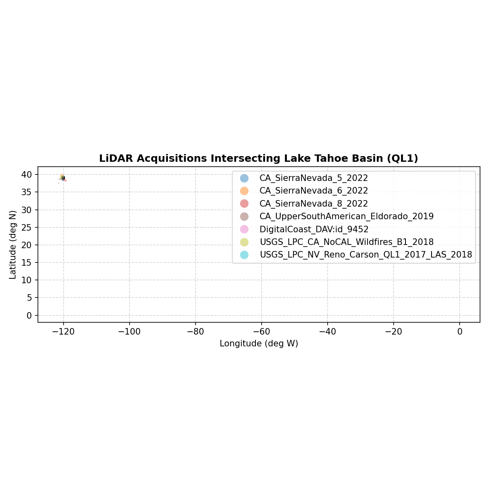

# Tutorial 01: Basic Discovery & Federated Ingestion

Welcome to **Tutorial 01** of the `als-finder` suite! In this module, you will learn how to:
1. Verify your environment and extract the bundled Lake Tahoe Basin sample Region of Interest (ROI).
2. Run a federated geospatial search across multiple federal and academic LiDAR repositories (**USGS 3DEP**, **NOAA Coastal**, and **OpenTopography**).
3. Inspect the resulting catalog outputs: `manifest.json`, `catalog.gpkg`, and `catalog.csv`.
4. Preview a dry-run download matrix (`fetch_array.csv`) prior to physical data retrieval.

---

## 1. Environment Verification & CLI Help

Let's ensure `als-finder` is properly installed and accessible:

```bash
als-finder --version
```

**Output:**
```text
als-finder version 0.2.0
```

---

## 2. Extracting the Example Region of Interest (ROI)

`als-finder` comes with a bundled sample GeoPackage boundary: the **Lake Tahoe Basin Management Unit (LTBMU)**.
We extract it to our working directory using `get-example-roi`:

```bash
als-finder get-example-roi
```

**Output:**
```text
Success! Example ROI extracted to: ./ltbmu_boundary.gpkg
```

### Inspecting with GeoPandas:
```python
import geopandas as gpd

roi_gdf = gpd.read_file("ltbmu_boundary.gpkg")
print(f"CRS: {roi_gdf.crs}")
print(f"Total Bounds (WGS84): {roi_gdf.total_bounds}")
```

**Output:**
```text
CRS: EPSG:4326
Total Bounds (WGS84): [-120.25205893   38.70424335 -119.85318282   39.32393646]
```

---

## 3. Executing a Federated Search

Now let's search across **USGS 3DEP** and **NOAA Coastal** (and OpenTopography if you have configured an API key) for high-density point clouds (`--density QL1` = $\ge 8.0 \text{ pts/m}^2$).

We specify `--workspace ./demo_workspace/` to isolate all generated metadata into its own directory:

```bash
als-finder search \
    --roi ./ltbmu_boundary.gpkg \
    --density QL1 \
    --date "2018-01-01/2024-12-31" \
    --workspace ./demo_workspace/ \
    --provider USGS_EPT \
    --provider NOAA_STAC
```

**Rendered Console Output:**
```text
=================================================================================================================
 LiDAR Data Search Results 
=================================================================================================================
 | Provider        | Name                                   | Date         |   Est (GB) |   pts/m2 |   Area km2 |
-----------------------------------------------------------------------------------------------------------------
 | USGS_EPT        | CA_SierraNevada_5_2022                 | 2022-??-??   |    1380.20 |  29.1700 |    6349.79 |
 | USGS_EPT        | CA_SierraNevada_6_2022                 | 2022-??-??   |    1136.46 |  26.2100 |    5819.74 |
 | USGS_EPT        | CA_SierraNevada_8_2022                 | 2022-??-??   |    1171.62 |  25.1400 |    6255.39 |
 | USGS_EPT        | CA_UpperSouthAmerican_Eldorado_2019    | 2019-??-??   |    2075.29 |  43.1000 |    6462.43 |
 | NOAA_STAC       | DigitalCoast_DAV:id_9452               | 2019-10-21   |    2075.29 |  46.7700 |    5954.91 |
 | USGS_EPT        | USGS_LPC_CA_NoCAL_Wildfires_B1_2018    | 2018-??-??   |     643.56 |  10.8900 |    7928.51 |
 | USGS_EPT        | USGS_LPC_NV_Reno_Carson_QL1_2017_LAS_2 | 2017-??-??   |     151.15 |   9.5400 |    2126.64 |
=================================================================================================================
 TOTAL DATASETS: 7 | ESTIMATED PAYLOAD: 8633.57 GB | QUERY TIME: 7.82s 
-----------------------------------------------------------------------------------------------------------------
 CATALOG TBL: demo_workspace/catalog/catalog.gpkg
 JSON METADATA: demo_workspace/catalog/manifest.json
=================================================================================================================
```

---

## 4. Exploring the Generated Catalog Outputs

The search command generated three primary catalog files inside `./demo_workspace/catalog/`:
1. `manifest.json`: Full master metadata document.
2. `catalog.gpkg`: Vector layer with precise polygon bounds of each dataset.
3. `catalog.csv`: Summary table for spreadsheet analysis.

### Reading CSV Summary Table:
```python
import pandas as pd

catalog_df = pd.read_csv("demo_workspace/catalog/catalog.csv")
print(catalog_df[["Provider", "Name", "Date", "PointDensity"]].head(3))
```

**Rendered Table:**
| Provider | Name | Date | PointDensity |
| :--- | :--- | :--- | :--- |
| **USGS_EPT** | `CA_SierraNevada_5_2022` | 2022 | 29.17 pts/m² |
| **USGS_EPT** | `CA_SierraNevada_6_2022` | 2022 | 26.21 pts/m² |
| **USGS_EPT** | `CA_SierraNevada_8_2022` | 2022 | 25.14 pts/m² |

### Visualizing Spatial Coverage Over the ROI:
```python
import geopandas as gpd
import matplotlib.pyplot as plt

roi_gdf = gpd.read_file("ltbmu_boundary.gpkg")
cat_gdf = gpd.read_file("demo_workspace/catalog/catalog.gpkg")

fig, ax = plt.subplots(figsize=(8, 8))
roi_gdf.plot(ax=ax, color="none", edgecolor="black", linewidth=2.5, label="ROI (Tahoe Basin)")
cat_gdf.plot(ax=ax, column="name", alpha=0.45, legend=True, cmap="tab10")
ax.set_title("LiDAR Acquisitions Intersecting Lake Tahoe Basin (QL1)", fontsize=12, fontweight="bold")
plt.xlabel("Longitude (deg W)")
plt.ylabel("Latitude (deg N)")
plt.grid(True, linestyle="--", alpha=0.5)
plt.tight_layout()
plt.show()
```

**Rendered Map Preview:**



---

## 5. Dry-Run Fetch Array Preview

Before downloading gigabytes of point cloud data, `als-finder download` generates a **Dry-Run Fetch Matrix** (`fetch_array.csv`).
This previews the number of physical tiles, estimated download sizes, and target file paths without writing data:

```bash
als-finder download \
    --workspace ./demo_workspace/ \
    --roi ./ltbmu_boundary.gpkg
```

**Rendered Matrix Output:**
```text
==================================================================================================
 LiDAR Fetch Array Matrix 
==================================================================================================
 | Provider        | Name                                   |    Tiles |    True Size |   Format |
--------------------------------------------------------------------------------------------------
 | USGS_EPT        | CA_SierraNevada_5_2022                 |        1 |      0.00 MB |     .laz |
 | USGS_EPT        | CA_SierraNevada_6_2022                 |        1 |      0.00 MB |     .laz |
 | USGS_EPT        | CA_SierraNevada_8_2022                 |        1 |      0.00 MB |     .laz |
 | USGS_EPT        | CA_UpperSouthAmerican_Eldorado_2019    |        1 |      0.00 MB |     .laz |
 | NOAA_STAC       | DigitalCoast_DAV:id_9452               |        1 |      0.00 MB |     .laz |
 | USGS_EPT        | USGS_LPC_CA_NoCAL_Wildfires_B1_2018    |        1 |      0.00 MB |     .laz |
 | USGS_EPT        | USGS_LPC_NV_Reno_Carson_QL1_2017_LAS_2 |        1 |      0.00 MB |     .laz |
==================================================================================================
 TOTAL ACQUISITIONS: 7 | PHYSICAL TILES: 7 | EXPECTED PAYLOAD: 0.00 MB
--------------------------------------------------------------------------------------------------
 FETCH TARGET URI: demo_workspace/catalog/fetch_array.csv
==================================================================================================
```

---

### 👉 Next Step
Proceed to [Tutorial 02: Point Cloud Normalization & STAC Catalogs](./02_normalization_and_stac.md) to apply SMRF ground classification and compute Height Above Ground (HAG)!
