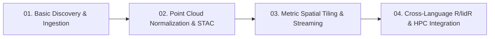

# ALS-Finder Interactive Tutorials & Learning Hub

Welcome to the **ALS-Finder** hands-on tutorial suite. These tutorials guide you through discovery, cloud-native streaming, standardization, metric vector tiling, and cross-language downstream scientific computing (Python + R + PDAL).

---

## 🚀 1-Click Launch in the Cloud

You do **not** need to install complex C++ dependencies (PDAL, GDAL, GEOS) or configure R spatial libraries on your local machine. 

Click the **Open in GitHub Codespaces** badge above to launch a complete, pre-configured cloud workstation in your browser with:
- **Python 3.11** + `als-finder`, `geopandas`, `pystac`, `laspy`
- **Native C++ Binaries** (`pdal`, `gdal`)
- **R Spatial Ecosystem** (`sf`, `lidR`, `terra`, `IRkernel`)
- **Interactive JupyterLab & VS Code IDE**

---

## 📚 Tutorial Curriculum

### [Tutorial 01: Basic Discovery & Federated Ingestion](./01_basic_discovery.ipynb)
- **Topics Covered**:
  - Setting up workspaces and OpenTopography API keys.
  - Loading Region of Interest (ROI) boundaries (GeoJSON, Shapefile, GPKG).
  - Executing federated multi-provider searches across **USGS 3DEP**, **NOAA Coastal**, and **OpenTopography**.
  - Inspecting the generated `catalog/manifest.json`, `catalog/catalog.gpkg`, and `catalog/catalog.csv`.
  - Previewing the dry-run download matrix (`fetch_array.csv`).

### [Tutorial 02: Point Cloud Normalization & OGC STAC Catalogs](./02_normalization_and_stac.ipynb)
- **Topics Covered**:
  - Raw point cloud format differences and ASPRS taxonomy harmonization.
  - Ground classification algorithms: **SMRF**, **CSF**, and **hybrid-dual**.
  - Normalizing heights: Computing Height Above Ground (**HAG**) via `filters.hag_nn`.
  - Exporting Cloud-Optimized Point Clouds (`.copc.laz`).
  - Generating validated **OGC SpatioTemporal Asset Catalogs (STAC)** (`catalog/stac/catalog.json`).
  - Generating 2D QA/QC Visual Previews (DEM hillshades and CHM color-relief).

### [Tutorial 03: Metric Spatial Tiling & Cloud-Native Streaming](./03_spatial_tiling_and_streaming.ipynb)
- **Topics Covered**:
  - Generating uniform metric vector grids (`grid_manager.py` / `als-finder grid-info`).
  - Memory-guarded zero-copy tile lookups (`als-finder fetch-tile --tile-id <ID>`).
  - Managing spatial overlap buffers (e.g., 30m buffer) to eliminate boundary edge artifacts.
  - Inspecting OS-level virtual memory capping (`RLIMIT_AS`) and automatic recursive sub-tiling under OOM.
  - Understanding the Hive-partitioned filesystem layout (`provider=*/dataset=*`).

### [Tutorial 04: Cross-Language Downstream Integration (Python + R + lidR + HPC)](./04_hpc_and_r_integration.ipynb)
- **Topics Covered**:
  - Interfacing R and Python: Extracting `als-finder` grid metadata via JSON pipelines (`r-jsonlite`).
  - Ingesting standardized COPC tiles into R using `lidR::readLAScatalog()`.
  - Calculating scientific forestry products in R: Digital Terrain Models (**DTM**), Canopy Height Models (**CHM**), and Individual Tree Detection (**ITD**).
  - Simulating distributed Slurm Job Arrays with bash commands inside Codespaces.
