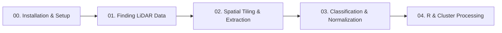

# ALS-Finder Tutorials

Welcome to the **ALS-Finder** tutorials. These guides walk through how to search for airborne LiDAR data, create spatial processing grids, extract tiles on demand, and process point clouds in Python and R (`lidR`).

---

## Tutorial Overview

### [Tutorial 00: Installation & Environment Setup](./00_installation_and_setup.ipynb)
- Setting up Python, Conda, or Docker.
- Checking required libraries (PDAL, GDAL, GEOS).
- Setting up optional API keys for providers that require them (OpenTopography, NASA Earthdata, NEON).

### [Tutorial 01: Finding LiDAR Data Across Repositories](./01_basic_discovery.ipynb)
- Searching for LiDAR coverage using a study area boundary (GeoJSON, Shapefile, or GeoPackage).
- Searching across **USGS 3DEP**, **NASA G-LiHT**, **NEON AOP**, **NASA Earthdata (ORNL DAAC)**, **NOAA**, and **OpenTopography**.
- Inspecting the resulting dataset catalog (`catalog.gpkg`, `catalog.csv`, and `manifest.json`).

### [Tutorial 02: Spatial Tiling & On-Demand Extraction](./02_spatial_tiling_and_streaming.ipynb)
- Creating a regular metric grid over your study area (`grid.gpkg`).
- Extracting specific sub-tiles on demand with a spatial buffer to avoid edge artifacts.
- Reading extracted tiles directly into Python (`laspy`) and R (`lidR`).

### [Tutorial 03: Point Cloud Classification & Height Normalization](./03_normalization_and_stac.ipynb)
- Harmonizing point cloud classification codes across projects.
- Ground filtering (SMRF and CSF algorithms).
- Computing Height Above Ground (HAG) to calculate canopy heights.
- Writing standardized `.laz` files and generating STAC metadata.

### [Tutorial 04: Analysis in R with lidR and Cluster Processing](./04_hpc_and_r_integration.ipynb)
- Reading extracted tiles into R using `lidR`.
- Generating standard forestry and ecology products: Digital Terrain Models (DTM), Canopy Height Models (CHM), and tree metrics.
- Running batch processing scripts across tiles on a computing cluster with Slurm.
