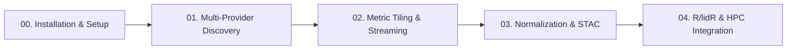

# ALS-Finder Interactive Tutorials & Learning Hub

Welcome to the **ALS-Finder** hands-on tutorial suite. These tutorials guide you through discovery, cloud-native streaming, standardization, metric vector tiling, and cross-language downstream scientific computing (Python + R + PDAL).

---

## 🚀 1-Click Launch in the Cloud

You do **not** need to install complex C++ dependencies (PDAL, GDAL, GEOS) or configure R spatial libraries on your local machine. 

Click the **Open in GitHub Codespaces** badge above to launch a complete, pre-configured cloud workstation in your browser with:
- **Python 3.11** + `als-finder`, `geopandas`, `pystac`, `laspy`
- **Native C++ Binaries** (`pdal`, `gdal`)
- **R Spatial Ecosystem** (`sf`, `lidR`, `terra`, `IRkernel`)
- **Interactive JupyterLab & VS Code IDE**

---

## 📚 Tutorial Curriculum

### [Tutorial 00: Installation & Environment Setup](./00_installation_and_setup.ipynb)
- **Topics Covered**:
  - Setting up Conda and Docker environments.
  - Verifying C++ dependencies (PDAL, GDAL, GEOS).
  - Configuring API tokens (`.env`, OpenTopography, NASA Earthdata, NEON).

### [Tutorial 01: Multi-Provider Discovery & Federated Catalogs](./01_basic_discovery.ipynb)
- **Topics Covered**:
  - Loading Region of Interest (ROI) boundaries (GeoJSON, Shapefile, GPKG).
  - Executing federated multi-provider searches across **USGS 3DEP**, **NASA G-LiHT**, **NEON AOP**, **NASA Earthdata (ORNL DAAC)**, **NOAA**, and **OpenTopography**.
  - Inspecting `catalog/manifest.json`, `catalog/catalog.gpkg`, and `fetch_array.csv`.

### [Tutorial 02: Metric Spatial Tiling & Cloud-Native Streaming](./02_spatial_tiling_and_streaming.ipynb)
- **Topics Covered**:
  - Generating uniform metric vector grids (`LazyGridManager` / `grid.gpkg`).
  - Memory-guarded zero-copy tile lookups (`als-finder fetch-tile --manifest grid.gpkg --tile-id <ID>`).
  - Spatial overlap buffers (e.g., 30m buffer) eliminating edge artifacts.
  - Streaming directly into Python (`laspy`) and R (`lidR`).

### [Tutorial 03: Point Cloud Normalization & OGC STAC Catalogs](./03_normalization_and_stac.ipynb)
- **Topics Covered**:
  - ASPRS taxonomy harmonization and ground classification (SMRF / CSF).
  - Computing Height Above Ground (**HAG**).
  - Exporting Cloud-Optimized Point Clouds (`.copc.laz`).
  - Generating validated **OGC SpatioTemporal Asset Catalogs (STAC)** (`catalog/stac/catalog.json`).

### [Tutorial 04: Cross-Language Downstream Integration (R + lidR + Slurm HPC)](./04_hpc_and_r_integration.ipynb)
- **Topics Covered**:
  - Interfacing R and Python via JSON pipelines (`jsonlite`).
  - Ingesting streamed sub-tiles in R using `lidR::readLAS()`.
  - Calculating scientific forestry products in R: Digital Terrain Models (**DTM**), Canopy Height Models (**CHM**), and Tree Metrics.
  - Distributed batch execution on HPC clusters.
